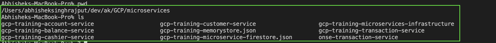
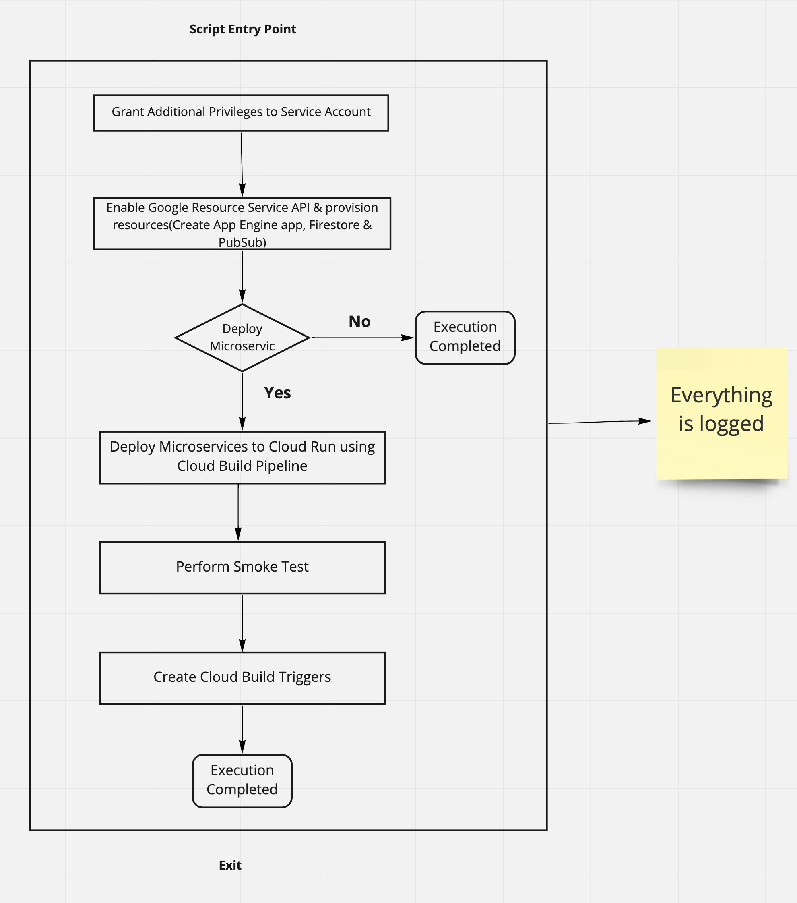

# GCP Infrastructure and Microservice Deployment Repository

## Before running the GCP infra pipeline ensure that following are there:
1. You must fork and clone the below given repositories in your workstation in the same directory where this Infra repository is cloned :
   * [gcp-training-customer-service](https://github.com/armakuni/gcp-training-customer-service)
   * [gcp-training-account-service](https://github.com/armakuni/gcp-training-account-service)
   * [gcp-training-cashier-service](https://github.com/armakuni/gcp-training-cashier-service)
   * [gcp-training-transaction-service](https://github.com/armakuni/gcp-training-transaction-service)
   * [gcp-training-balance-service](https://github.com/armakuni/gcp-training-balance-service)
   * [gcp-training-microservices-smoke-test](https://github.com/armakuni/gcp-training-microservices-smoke-test)

   Your project structure should look something like this where all projects are cloned at the same level.
   
2. You must update the "repo_owner" property in [config.cfg.defaults](config.cfg.defaults) file with your ```GitHub-UserId```.
   Else the script will not execute and throw an error.
   
   Once replaced config.cfg.defaults should look something like
   ```
    deploy_microservices=true
    cloudbuild_sa_role=roles/owner
    transaction_topic_name=transactions
    balance_topic_name=balance
    repo_owner=[GITHUB_ID]
   ```
3. The default behavior(configured) of the script is to deploy the Microservices and run smoke tests.
    If you wish to manually deploy these Microservices then set the below property to ```false``` in [config.cfg.defaults](config.cfg.defaults).
   ```
   deploy_microservices=true
   ```
4. Your account should have higher level privileges(may be the owner) to execute this script as it involves enabling the APIs and provisioning GCP resources.
5. The Cloud Build Service Account has the access or role allocated to provision the resources (Service Account, PubSub, Firestore etc)
   
## Execution:

**NOTE:** This training exercise currently uses Google Cloud CLI commands which are in alpha and beta stages. This means that there is a possibility that the setup script you will be instructed to run may fail when there are updates to these commands. We try to keep this lab up to date but if problems occur please inform the workshop leader and they will assist you.

Before execution ensure that you are in the root of the infra repository.

The [setup_gcp_infra](setup_gcp_infra.sh) script performs below tasks:
1. Enabling Google APIs
2. Grant role to the Cloud Build Service Account with higher privileges
3. Create Firestore Instance
4. Create a PubSub topic
5. Deploy Microservices if first parameter ```deploy_microservices``` in [config.cfg.defaults](config.cfg.defaults) is set to ```true```, default is ```true```
6. If opted to deploy Microservices then will trigger the Smoke Tests in Cloud Build Pipeline against the newly deployed Microservices.
7. Creates Cloud Build Triggers for each Microservice
   
The below diagram should help you to understand the execution flow within the infra script:

   
Execute below command to run the script:

```bash
./setup_gcp_infra.sh > infra_execution_$(date +%s).log
```

Here ```infra_execution_[TIMESTAMP].log``` file will store the execution logs for debugging purpose.

### If "deploy_microservices" was set to "true"
The setup script will generate ```microservice_url_env.sh``` file which will have all the respective endpoints and exported as environment variables.
This ```microservice_url_env.sh``` will be handy when you would like to run the Smoke Test manually in later stages.

### If "deploy_microservices" was set to "false"
As you have opted for deploying the Microservices by yourselves we would recommend you to follow below sequence while deploying the same.

Even though the deployment is independent of each other but to work as expected the Microservices internally makes call to each other.

This is covered and explained in detail in each Microservice documentations.

* [gcp-training-customer-service](https://github.com/armakuni/gcp-training-customer-service)
* [gcp-training-account-service](https://github.com/armakuni/gcp-training-account-service)
* [gcp-training-cashier-service](https://github.com/armakuni/gcp-training-cashier-service)
* [gcp-training-transaction-service](https://github.com/armakuni/gcp-training-transaction-service)
* [gcp-training-balance-service](https://github.com/armakuni/gcp-training-balance-service)

## Assumptions: 

1. All the previous labs are completed. Hence Cloud Build API is enabled and associated Service Account already exists.
